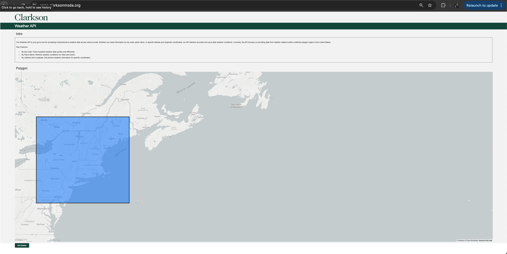
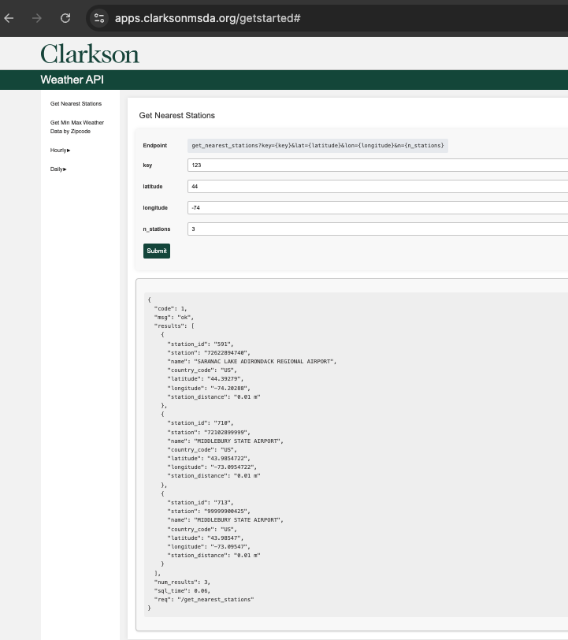

# Weather API
##### Author: Rakesh Kantharaju





### Project Description:

Build an API which gets you daily and hourly weather data for areas under the given polygon

Overall process:

- We have weather data available in csv files from the below site and each csv file contains hourly weather data for a given station. 

The dataset is provided by `National Centers for Environmental Information`. You can find the dataset here. 

Hourly weather data
https://www.ncei.noaa.gov/data/global-hourly/archive/csv/ 

- The data ranges from year 1901 - 2023 for all the stations accross the world and its hourly, so you can imagine how huge the dataset is.

- Professor Tyler has extracted these files and stored in files_workspace server.

- Going forward Ill explain how I extracted data from the above server based on the polygon we decided and stored in a designated mysql server which is used for our API.

- I also have another csv file which has all the zipcodes info for all over the world. I have loaded this dataset into our designated mysql server which is necessary for our API.

- Finally build a Flask application and create endpoints for the users to view/pull the reauired weather data.

#### Dataset description

(Detailed description available in houlry_weather_data_doc.pdf)

STATION - Station identifier no 

DATE - Date the record is captured

SOURCE - The flag of a GEOPHYSICAL-POINT-OBSERVATION showing the source or combination of sources used in creating the
observation

LATITUDE & LONGITUDE - Geo point location of the station

ELEVATION - The elevation of a GEOPHYSICAL-POINT-OBSERVATION relative to Mean Sea Level (MSL).

NAME - Station name

REPORT_TYPE - The code that denotes the type of geophysical surface observation.

CALL_SIGN - The identifier that represents the call letters assigned to a FIXED-WEATHER-STATION.

QUALITY_CONTROL - The name of the quality control process applied to a weather observation.

WND - Wind Observation values 
    (a,b,c,d,e)

    a - direction angle
    b - direction quality code
    c - type code
    d - speed rate
    e - speed quality code

CIG - Sky condition Observation values
(a,b,c,d)

    a - ceiling height dimension
    b - ceiling quality code
    c - ceiling determination code
    d - cavok code

VIS - Visibility Observation values
(a,b,c,d)

    a - distance dimension
    b - distance quality code
    c - variability code
    d - quality variability code

TMP - Air Temperature Observation
(a,b)

    a - air temperature
    b - air temperature quality code

DEW - Air Dew point Observation
(a,b)

    a - air dew point temperature
    b - air dew point quality code

SLP - Sea level Observation 
(a,b)

    a - sea level pressure
    b - sea level pressure quality code


## Setup flask-docker-stack-main

Before we begin, we need to build the following services:

- MySQL (db): Provides a backend database to store data in an organized way.
- phpMyAdmin (phpmyadmin): A web-based interface to view and manage the MySQL database, including building and executing queries.
- Web Application (web): Hosts the custom web application built using Apache and Flask.
- SSL Certificate Manager (ssl): Uses the jonasal/nginx-certbot image to handle SSL certificates and manage secure HTTPS traffic.

Using the docker-compose.yml file I have set up the above. 

## loader script

The purpose of this loader script is to load the houlry weather data based on start year, end year and the polygon coordinates.

### Create index.txt

- Create an index.txt file which connects to files_workspace , iterates through all the csv files for all the years and then extract the below info and store it in the index.txt file.
- Sample Info: 
```json
    {"station": "72217513860", "lat": "32.63333", "lon": "-83.6", "year": "2022", "file_name": "72217513860.csv"}
 ```

- Similary , we store the data for all stations, their coordinates, accross all years along with their filename.

**Why index.txt?**

The purpose of index.txt file is to keep track of all station files and their details like station name, lat,lon ,year and file name. We use this file to fetch stations which fall under our polygon and given years.

By doing this, we dont have to download all the files from files_workspace but the files only which falls under our polygon and only for the given years.

### config.yml

```yml
load:
  path: 'csv' # directory to store downloaded weather csv files
  year: '2022' # 
  start_year: 1901 # loading start year
  end_year: 2023 # loading end year
  period: 'hourly' # hourly data 
  polygon: [ # our polygon coordinates
          [
            [
              -77.90335456889079,
              46.075580026850844
            ],
            [
              -77.90335456889079,
              39.2376280432014
            ],
            [
              -67.86436058248752,
              39.2376280432014
            ],
            [
              -67.86436058248752,
              46.075580026850844
            ],
            [
              -77.90335456889079,
              46.075580026850844
            ]
          ]
        ]
files_workspace: # source : where our weather csv files are located
  host: hostname
  username: username
  password: password
  port: 2022
  path: srv/sftpgo/data/users/kanthar@clarkson.edu/nws-hourly/csv

db: # destination : our mysql db (store our data for our API)
  username: username_for_mysql
  password: password
  hostname: 'apps.clarksonmsda.org'
  port: 3306
  database_name: 'weather_info'
  ```

### loader.py

This is where the main loading mechanism is executed

import required packages and setup logger file to keep track of things

```python 
import json
import pandas as pd
import os
import glob
from shapely.geometry import Polygon
import yaml
from shapely import Point
import datetime
import paramiko
import time
from sqlalchemy import create_engine,event,text
import urllib.parse
import csv
import time
import logging
from logging.handlers import RotatingFileHandler

logger = logging.getLogger('my_logger')
logger.setLevel(logging.DEBUG)
# Create a file handler which rotates after every 5 MB
handler = RotatingFileHandler('my_log.log', maxBytes=5*1024*1024, backupCount=5)
formatter = logging.Formatter('%(asctime)s - %(name)s - %(levelname)s - %(message)s')
handler.setFormatter(formatter)
logger.addHandler(handler)
```


create class loader and required properties in the constructor 

```python
class loader:
    def __init__(self): 
        self.config=None
        self.path=None
        self.year=None
        self.period=None
        self.coordinates=None
        self.polygon=None
        self.no_of_files=0
        self.st_files=[]
        self.st_files_count=0
        self.ssh_client=None
        self.ftp=None
        self.download_path=None
        self.required_cols=['STATION',
                   'DATE',
                   'LATITUDE',
                   'LONGITUDE',
                   'NAME',
                   'WND',
                   'CIG',
                   'VIS',
                   'TMP',
                   'DEW',
                   'SLP',
                   'KA1',
                   'KA2',
                   'MA1',
                   'MD1',
                   'OC1',
                   'OD1']

        self.station_details=[]
        self.engine=None
        self.wdf=None

        with open('config.yml','r') as stream:
            self.config=yaml.safe_load(stream)
        self.create_polygon()
```

*create_polygon*

This function will create polygon based on coordinates from config.yml file

```python
    def create_polygon(self): # create a polygon based on the given coordinates in config file
        logger.info("Creating polygon from given coordinates...")
        self.coordinates = self.config['load']['polygon'][0]
        for i in range(len(self.coordinates)):
            self.coordinates[i] = self.coordinates[i][::-1]
        try:
             self.polygon = Polygon(self.coordinates)
        except Exception as e:
            logger.debug(f"Error creating polygon: {e}")
            print("Error creating polygon:",e)
```

*get_stfiles*

This function will iterate through our index.txt file, checks weather year falls under our start and end year. If yes, gets its lat and lon value to check if the station falls under our polygon. If yes , appends the file name to the self.st_files list

```python
    def get_stfiles(self): # get list of files whose stations fall inside the polygon
        logger.info("Get station file names inside polygon from index file")
        file_count=0
        with open('index.txt','r') as f:
            for line in f:
                data=json.loads(line)
                if int(data['year']) in range(self.config['load']['start_year'],self.config['load']['end_year']):
                    # print(data['year'])
                    try:
                        lat=float(data['lat'])
                        lon=float(data['lon'])
                    except Exception as e:
                        print(e)
                    
                    point = Point(lat, lon)
                    if self.polygon.contains(point):
                        self.st_files.append(data['file_name'])
                        file_count+=1
                    self.st_files_count=file_count
        logger.debug(f"{self.st_files_count} files to be downloaded")
```

*connect_filesworkspace*

Based on the credentials from config.yml file , we connect to files_workspace server to download the required files.

```python
    def connect_filesworkpace(self): # connect to filesworkspace server
        logger.info("Connecting to filesworkspace...")
        self.ssh_client = paramiko.SSHClient()
        self.ssh_client.set_missing_host_key_policy(paramiko.AutoAddPolicy())
        try:
            self.ssh_client.connect(hostname=self.config['files_workspace']['host'],
                            port=self.config['files_workspace']['port'],
                            username=self.config['files_workspace']['username'],
                            password=self.config['files_workspace']['password'])
            
            self.ftp=self.ssh_client.open_sftp()
            return 'Connected'
        except Exception as e:
            return Exception
```

*create_dir*

This function is used to create directories and subdirectories based on ouyr config file to store our data once downloaded in an organised way.

```python
    def create_dir(self): # create directories/folders to store downloaded files
        logger.info("Creating directories to store station files")
        for year in range(self.config['load']['start_year'],self.config['load']['end_year']):
            dir_path=os.path.join('csv',self.config['load']['period'],str(year))
            if not os.path.exists(dir_path):
                os.makedirs(dir_path)
            else:
                print("Folder already exists")
```


*download_files*

Based on the file names that we have in st_files list , we connect to files_workspace and download the files and store in their respective year directory.

```python
    def download_files(self): # once connected to filesworkspace server, download the st_files 
        self.get_stfiles()
        conn = self.connect_filesworkpace()
        if conn=="Connected":
            st=time.time()
            self.create_dir()
            n=0
            logger.info("Downloading station files from workspace")
            for year in range(self.config['load']['start_year'],self.config['load']['end_year']):
                x=0
                path=os.path.join(self.config['files_workspace']['path'],str(year))
                logger.debug(f"Downloading to path {path}")
                for file in self.ftp.listdir(path):
                    if file in self.st_files:
                        fp=os.path.join(path,file)
                        self.download_path=os.path.join('csv',self.config['load']['period'],str(year))
                        self.ftp.get(fp,os.path.join(self.download_path,file))
                        n+=1
                        x+=1
                        if n%15==0:
                            logger.debug(f"{n} files downloaded")
            self.ssh_client.close()
            logger.debug(f"Time taken to download csv files from workspace:{time.time()-st}")
```

*mysql_connect*

This function connects to mysql server using crediatials given in config file.

```python
    def mysql_connect(self):
        logger.info("Connecting to mysql...")
        username = self.config['db']['username']
        password = self.config['db']['password']
        hostname = self.config['db']['hostname']
        port = self.config['db']['port']
        database_name = self.config['db']['database_name']
        encoded_password = urllib.parse.quote_plus(password)

        connection_string = f'mysql+pymysql://{username}:{encoded_password}@{hostname}:{port}/{database_name}'
        print(connection_string)
        try:
            self.engine = create_engine(connection_string)
            self.engine.connect()
            logger.info("Connected to mysql")
            print("Connected to mysql")
        except Exception as e:
            logger.debug(f"Connection to myqsl Unsuccessful {e}")
            print("Connection to myqsl Unsuccessful", e)

        @event.listens_for(self.engine, "before_cursor_execute")
        def receive_before_cursor_execute(
            conn, cursor, statement, params, context, executemany
                ):
                    if executemany:
                        cursor.fast_executemany = True
```

*merge_files*

This functions creates a single dataframe from all the csv files in a year directory based on the required columns we need defined in the class properties.

```python
    def merge_files(self,year):
        logger.info("Starting to merge csv files to a dataframe..")
        st=time.time()
        dfs=[]
        path='csv'
        period=self.config['load']['period']
        pp=os.path.join(path,period)
        n=0
        logger.debug(f"Merging csv files for year {year}")
        yp=os.path.join(pp,year)
        for file in os.listdir(yp):
            n+=1
            fp=os.path.join(yp,file)
            logger.debug(f"reading file {fp}")
            df=pd.read_csv(fp)
            logger.debug(f"File shape {df.shape}")
            for col in self.required_cols:
                if col not in df.columns:
                    df[col]=999999
            dfs.append(df[self.required_cols])
        self.frame = pd.concat(dfs, axis=0, ignore_index=True)
        self.clean_frame()
        logger.info(f"Merging completed in {time.time()-st}")
```

*clean_frame*

We have few columns in our csv file which has comma seperated values. We need to split them into respective columns and store data. This functions iterated through the dataframe created above and splits the columns to the required cols.

```python
    def merge_files(self,year):
        logger.info("Starting to merge csv files to a dataframe..")
        st=time.time()
        dfs=[]
        path='csv'
        period=self.config['load']['period']
        pp=os.path.join(path,period)
        n=0
        logger.debug(f"Merging csv files for year {year}")
        yp=os.path.join(pp,year)
        for file in os.listdir(yp):
            n+=1
            fp=os.path.join(yp,file)
            logger.debug(f"reading file {fp}")
            df=pd.read_csv(fp)
            logger.debug(f"File shape {df.shape}")
            for col in self.required_cols:
                if col not in df.columns:
                    df[col]=999999
            dfs.append(df[self.required_cols])
        self.frame = pd.concat(dfs, axis=0, ignore_index=True)
        self.clean_frame()
        logger.info(f"Merging completed in {time.time()-st}")
```

*load_station_details*

Before we start loading the weather data I need to store/load the station details in our database and also create a csv file for station details.

**Why?**
There are many reasons why we need to do this , lets state a dew.

- create a primary key for each station
    - how? using factorize method in python which creates unique value for values in a given series.

- Lets say you need to extract weather data for Postdam by its name or coordinates. We need to figure out which stations are near to Potsdam or the given coordinates.
To do this, we need to calcualate the distance between the given coordinates and all the station coordinates and sort it in ascending order to get the nearest station. 

If we do not have a seperate table for station details , we have to hit the main weather table data everytime to do this, which is very huge and time consuming task. This is one of the reason why we need to create station details table.

- Bring country name, place names for the stations. 

- We need to normalize the data that we store in our database. This is one of the other reasons why we need to store data in such way.


```python
    def load_station_details(self):
        logger.info("Starting : Load station details")
        st=time.time()
        ext='csv'
        path=os.path.join("csv",self.config['load']['period'])
        for year in range(self.config['load']['start_year'],self.config['load']['end_year']):
            logger.debug(f"Loading year {year}")
            yp=os.path.join(path,str(year))
            for file in os.listdir(yp):
                csv_fp=os.path.join(yp,file)
                if ext in csv_fp:
                    with open(csv_fp, 'r') as f:
                        rf = csv.reader(f)
                        x = 0
                        for row in rf:
                            if x == 0:
                                header = [s.strip('"') for s in row]
                                dt_idx=header.index('DATE')
                                st_idx = header.index('STATION')
                                name_idx = header.index('NAME')
                                lat_idx = header.index('LATITUDE')
                                lon_idx = header.index('LONGITUDE')
                            if x==1:
                                sd={}
                                date=row[dt_idx].strip('"')
                                dto=datetime.datetime.strptime(date,'%Y-%m-%dT%H:%M:%S')
                                sd['year']=dto.year
                                sd["station"] = row[st_idx].strip('"')
                                sd["name"] = row[name_idx].strip('"')
                                sd["latitude"] = row[lat_idx].strip('"')
                                sd['longitude']=row[lon_idx].strip('"')
                                self.station_details.append(sd)
                            x+=1
                            if x>1:
                                break

        df=pd.DataFrame(self.station_details)
        df=df.drop_duplicates()
        df[['name','country_code']]=df['name'].str.split(', ',expand=True)
        df['country_code']=df['country_code'].apply(lambda x: str(x)[-2:])

        logger.debug(f"Station df size {df.shape} ,adding country names")
        c=open('additional_files/country_list.txt','r')
        s=c.read()
        country_list=s.split("\n")
        country_code=[]
        country_name=[]
        n=0
        for item in country_list:
            if n>1:
                s=item.replace(' ','')
                country_code.append(s[0:2])
                country_name.append(s[2:])
            n+=1
        
        country_df=pd.DataFrame({'country_code':country_code,'country_name':country_name})
        self.station_info=df.merge(country_df,on=['country_code'],how='left')
        self.station_info = self.station_info.rename(columns={col: col.lower() for col in self.station_info.columns})
        col_order=['year','station','name','latitude','longitude','country_code','country_name']
        self.station_info=self.station_info[col_order]

        self.station_info['station_id'],_ = pd.factorize(self.station_info['station'])
        self.mysql_connect()
        self.station_info.to_csv('stations.csv',index=False)
        logger.debug(f"station_df {self.station_info.shape} loading")
        self.station_info.to_sql('stations',con = self.engine,if_exists='replace',index=False)
        logger.debug(f"Successfully loaded, time taken {st-time.time()}")
        #     # CREATE UNIQUE INDEX station_id_location_index
        #     # ON weather_hourly.stations_info (station_id, longitude,latitude);
        #     print('Stations info loaded successfully')
```

*load_weather_data*

- Finally the main function which iterates through start and end_year. 

- for each year , merge_files function is called , which merges all csv files under the given year directory and creates a dataframe and then cleans it.

- Get the primary key to for all the stations based on the csv that we created in load_station_files function.

- connect to mysql

- load the data using execute many.


*insert_zipcodes*

Function to load the zipcodes data that I extracted online.

```python
    def insert_zipcodes(self):
        print("loading zipcodes")
        zipcodes=pd.read_csv('additional_files/geonames-postal.csv',on_bad_lines='skip',delimiter=';')
        zipcodes=zipcodes.drop(['admin name3','admin code3','accuracy'],axis=1)
        cols=['country_code','postal_code','place_name','state','state_code','county','county_code','latitude','longitude','coordinates']
        zipcodes.columns=cols
        self.mysql_connect()
        zipcodes.to_sql('zipcodes',con = self.engine,if_exists='replace',index=False)
```

*load_new_stations*

Suppose you are loading a new year data. Before loading weather data we need to load their station details first. Keeping in mind we have already loaded older station details before along with primary key. We need to load new station details starting from max primary key that we have loaded previously.

*main*

```python
if __name__ == '__main__':
    ld=loader()
    # ld.download_files()

    ld.load_weather_data()
    print("Loading complete")
```


## Flask API

Sample endpoint 

Based on a given lat , lon and n value it gives n nearest station details.

/get_nearest_stations?key=123&lat=44.6592&lon=-74.9681&n=15


```python
@app.route("/get_nearest_stations",methods=['GET','POST'])
def get_nearest_stations():
    res={}
    key=request.args.get("key")
    if key!='123':
        res['code']=0
        res['msg']='Invalid key'
        return json.dumps(res,indent=4)
    
    lat=request.args.get("lat")
    lon=request.args.get("lon")
    n=request.args.get("n")
    try:
        latitude=float(lat)
        longitude=float(lon)
        n=int(n)
    except:
        res['code']=0
        res['msg']='Invalid entry'
        return json.dumps(res,indent=4)

    get_zip_coords_sql=open('sql_scripts/get_nearest_stations.sql').read()
    start_time=time.time()
    cur.execute(get_zip_coords_sql,(latitude,latitude,
                                 longitude,longitude,
                                 latitude,latitude,
                                 longitude,longitude,
                                 n))
    end_time=time.time()
    

    res['code']=1
    res['msg']='ok'

    output=[]
    for row in cur:
        print(row)
        item={}
        item['station_id']=str(row['station_id'])
        item['station']=str(row['station'])
        item['name']=str(row['name'])
        item['country_code']=str(row['country_code'])
        item['latitude']=str(row['latitude'])
        item['longitude']=str(row['longitude'])
        item['station_distance']=str(round(row['distance'],2))+" m"
        output.append(item)

    res['results']=output
    res['num_results']=len(output)
    res['sql_time']=round(end_time-start_time,2)
    
    res['req']='/get_nearest_stations'
    return json.dumps(res,indent=4)
```


Other endpoints

- get nearest station details in tabular format based on given lat and lon value 
```/getTableData_nearest_stations?key=123&lat=44.6592&lon=-74.9681&n=2```

- get hourly weather data by by given zipcode , date and hour
```/getData_by_zip_by_date_by_hour?key=123&zipcode=13676&date=2022-01-01&hour=13```

- get hourly weather data by given zipcode , date and for all hours 
```getData_by_zip_by_date_all_hours?key=123&zipcode=13676&date=2022-01-01```

- get hourly weather data by given zipcode , date and all hours (Tabular format)
```/getTableData_by_zip_by_date_all_hours?key=123&zipcode=13676&date=2022-01-01```

- get weather data by date and station id 
```/getData_by_station_id_by_date?key=123&station_id=2473&date=2022-01-01```

- get weather data by station id and date range 
```/getData_by_station_id_by_daterange?key=123&station_id=2473&start_date=2022-01-01&end_date=2022-01-02```

- get weather data by station id by daterange (Tabular format)
```/getTableData_by_station_id_by_daterange?key=123&station_id=7&start_date=2010-01-01&end_date=2010-01-02```

- get weather data by zipcode by date 
```/getData_by_zip_by_date?key=123&zipcode=13676&date=2022-01-01```

- get weather data by given placename and date
```/getData_by_placename_by_date?key=123&place_name=potts&country_code=us&date=2022-01-01```

- get weather data by given placename and date (Tabular format)
```/getTableData_by_placename_by_date?key=123&place_name=potts&country_code=us&date=2022-01-01```


